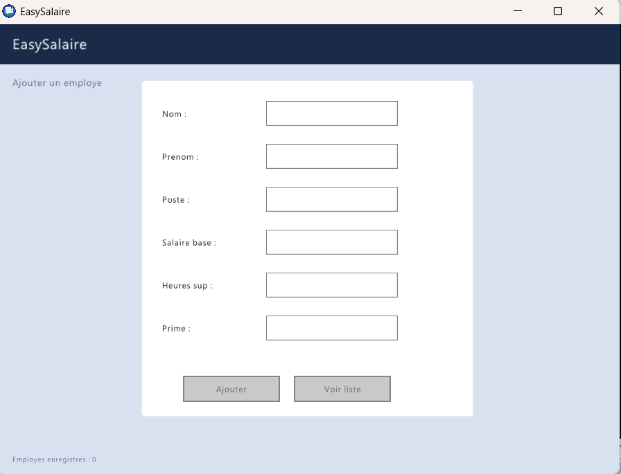
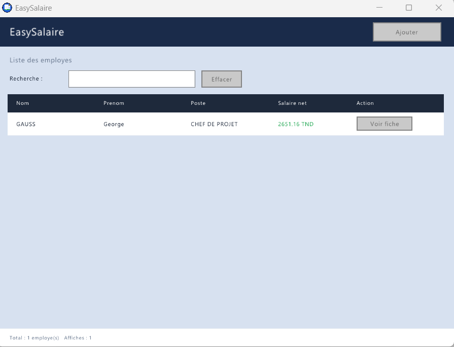
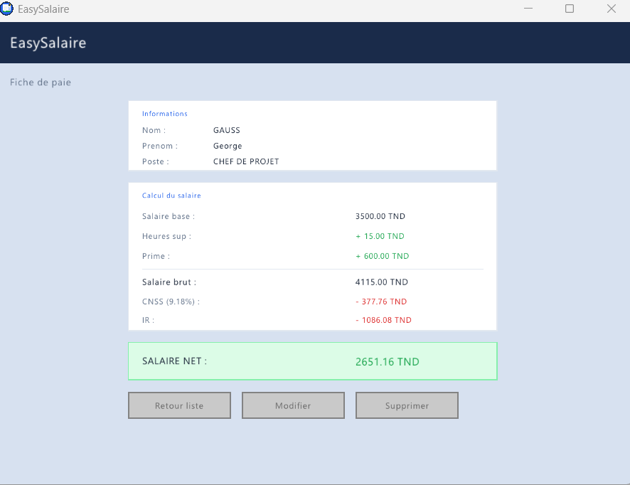

# EasySalaire

A lightweight employee management desktop application built in C, using [raylib](https://www.raylib.com/) and [raygui](https://github.com/raysan5/raygui) for the graphical interface.

<!-- Optional badges — remove if you don't want them -->


## Screenshots







## Features

- 📋 **Employee registration form** — add new employees through a simple GUI form
- 🔍 **Search by name** — quickly find an employee from the list
- 📁 **Employee details view** — view an individual employee's full record
- 🖥️ **Native desktop GUI** — built with raylib/raygui, no browser or heavy framework required

<!-- Add/edit this list to match what your app can actually do -->

## Tech Stack

- **Language:** C
- **GUI Library:** [raylib](https://www.raylib.com/) + [raygui](https://github.com/raysan5/raygui)
- **IDE:** Code::Blocks
- **Compiler:** MinGW (GNU GCC, x86_64)

## Project Structure

```
EasySalaire/
├── src/            # Source code (main.c, employe.c, employe.h)
├── lib/            # raylib and raygui library files
├── assets/         # Images, icons, and other resources
├── EasySalaire.cbp # Code::Blocks project file
└── README.md
```

## Getting Started

### Prerequisites

- [Code::Blocks](http://www.codeblocks.org/) with the MinGW GCC compiler (bundled with the default Windows install)
- [raylib](https://github.com/raysan5/raylib/releases) and [raygui](https://github.com/raysan5/raygui) — already included in `lib/`

### Build & Run

1. Clone the repository
   ```bash
   git clone https://github.com/azizab-aziz/easysalaire.git
   ```
2. Open `EasySalaire.cbp` in Code::Blocks
3. Build the project (`Build → Build`, or `Ctrl+F9`)
4. Run it (`Build → Run`, or `F9`)

## Roadmap

<!-- Optional — list what you plan to add next, shows the project is active -->
- [ ] Edit/update existing employee records
- [ ] Delete employee records
- [ ] Export employee list to CSV
- [ ] Salary calculation module

## License

This project is licensed under the MIT License — see the [LICENSE](LICENSE) file for details.
