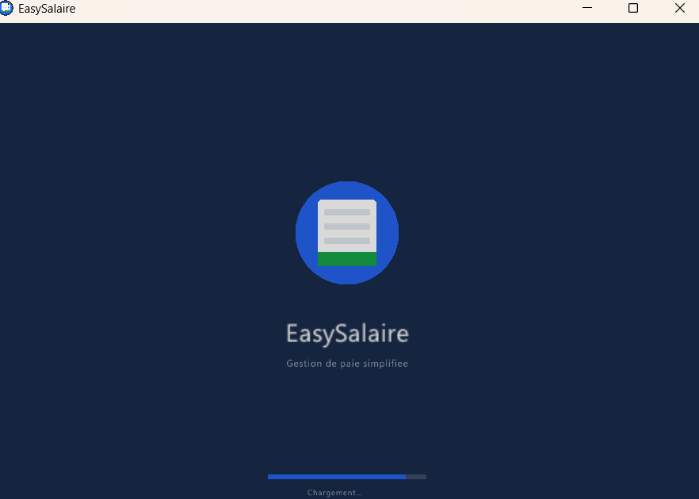
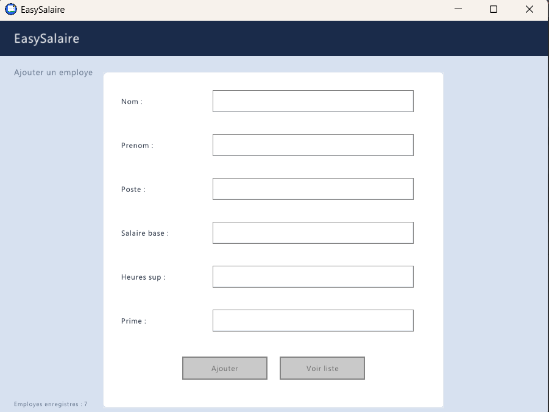
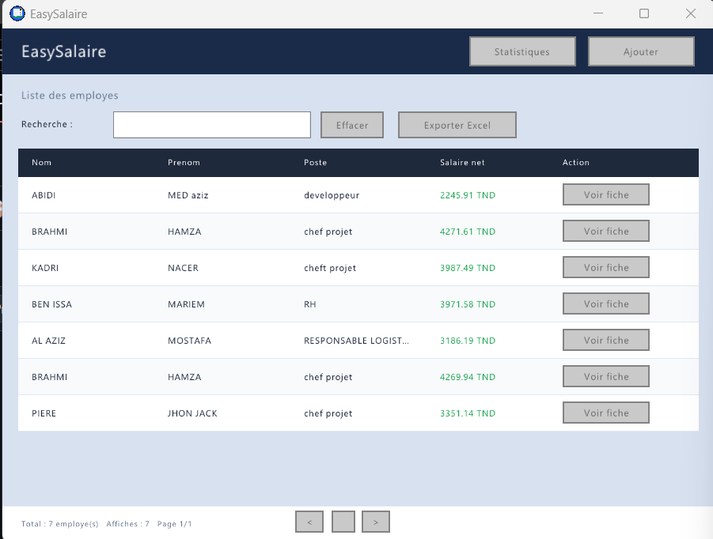
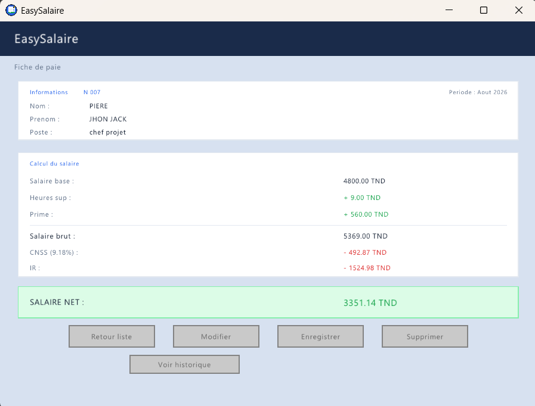
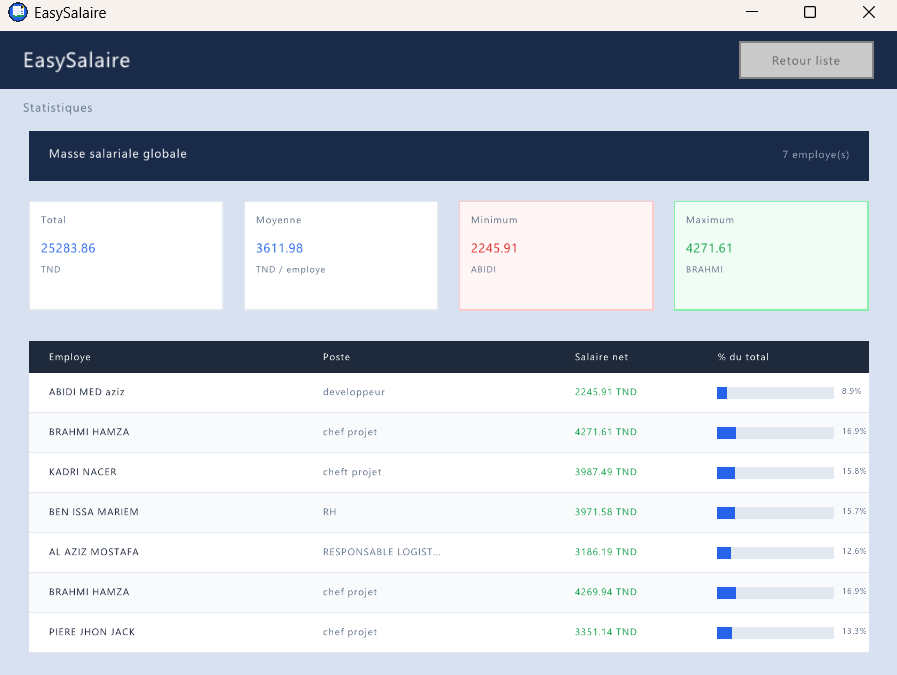
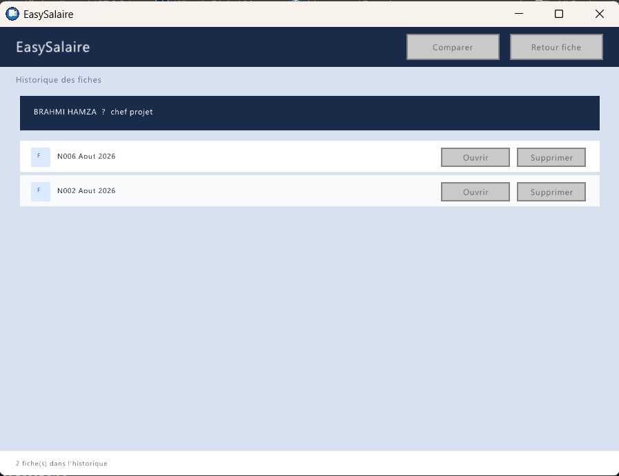
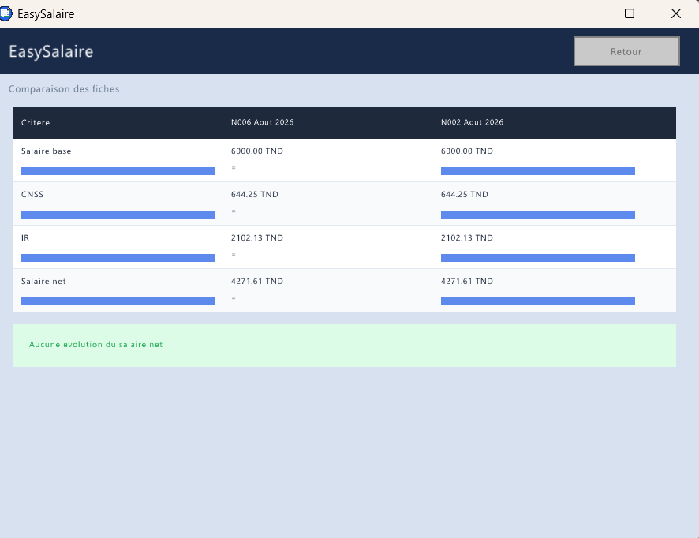
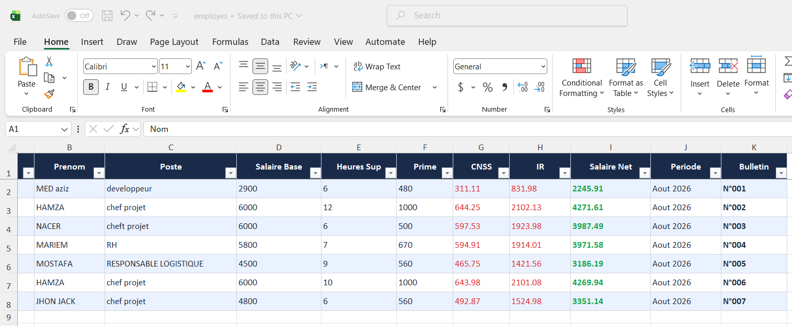
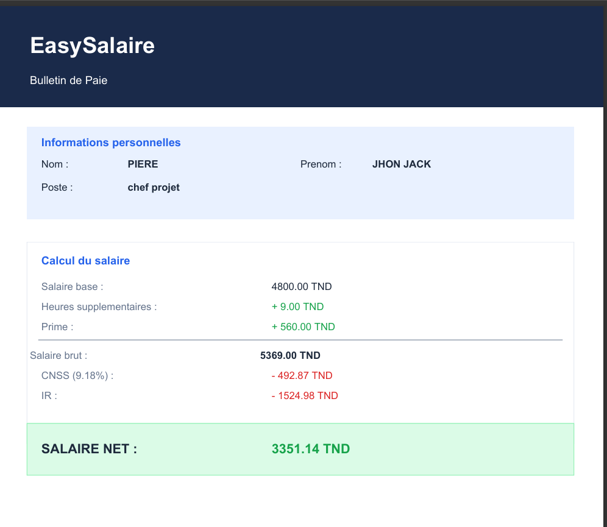

# EasySalaire

> **Application desktop de gestion de paie** développée en langage C avec Raylib/Raygui.  
> Implémente les formules officielles tunisiennes : CNSS 9.18% + IR progressif par tranches.

---

## Aperçu

EasySalaire est un logiciel de paie léger, autonome et gratuit pour les petites entreprises tunisiennes. Il calcule automatiquement les salaires, génère des fiches de paie, exporte en Excel/PDF et conserve un historique complet par employé.

---

## Screenshots

### Écran d'accueil (Splash Screen)
```

```

### Formulaire d'ajout
```

```

### Liste des employés
```

```

### Fiche de paie
```

```

### Statistiques
```

```

### Historique des fiches
```

```

### Comparaison de fiches
```

```

### Export Excel
```

```

### Export PDF
```

```

---

## Fonctionnalités

### Gestion des employés
- Ajouter un employé via formulaire graphique
- Modifier les informations d'un employé existant
- Supprimer un employé avec confirmation
- Navigation clavier complète (Tab, ↑↓, Enter)
- Recherche par nom ou prénom (insensible à la casse)
- Tri de la liste par nom, poste ou salaire net
- Pagination automatique (10 employés par page)

### Calculs salariaux
- Calcul automatique du salaire brut
- CNSS : 9.18% part salariale
- IR : barème progressif tunisien par tranches
- Salaire net calculé instantanément

### Fiche de paie
- Affichage détaillé de tous les calculs
- Numéro de bulletin automatique (N°001, N°002...)
- Date de la période (Janvier 2026, Février 2026...)
- Export en `.txt` (fiche individuelle)
- Export en `.csv` (liste complète)
- Export en `.pdf` (mise en page professionnelle)
- Export en `.xlsx` (Excel formaté via Python)

### Historique
- Sauvegarde automatique de chaque bulletin dans `saves/historique/`
- Consultation de l'historique par employé
- Suppression d'une fiche avec confirmation
- Comparaison entre deux fiches (évolution mois par mois)

### Statistiques
- Masse salariale totale
- Salaire moyen par employé
- Salaire minimum et maximum
- Tableau détaillé avec pourcentage par employé
- Barres de progression visuelles

### Interface
- Splash screen animé au démarrage
- Interface responsive (s'adapte à toute taille de fenêtre)
- Palette de couleurs professionnelle (navy + bleu accent)
- Police Segoe UI chargée dynamiquement
- Messages de succès avec fade-out après chaque action
- Confirmations avant suppression
- Icône personnalisée (fenêtre + taskbar)

---

## Architecture du projet

```
EasySalaire/
├── src/
│   ├── main.c              ← Interface graphique + navigation (9 écrans)
│   ├── employe.c           ← Logique métier + sauvegarde + historique
│   └── employe.h           ← Struct + constantes + prototypes
├── lib/
│   ├── raylib/
│   │   ├── raylib.h
│   │   ├── libraylib.a
│   │   ├── libraylibdll.a
│   │   └── raylib.dll
│   └── raygui/
│       └── raygui.h
├── assets/
│   └── easysalaire.ico
├── saves/
│   ├── employes.csv            ← Données internes (auto-sauvegarde)
│   ├── employes.xlsx           ← Export Excel formaté
│   ├── export_excel.py         ← Script Python d'export Excel
│   ├── export_pdf.py           ← Script Python d'export PDF
│   ├── NOM_PRENOM_fiche.txt    ← Fiches individuelles
│   └── historique/
│       └── NOM_PRENOM/
│           ├── N001_Juillet_2026.txt
│           └── N002_Aout_2026.txt
└── easysalaire.rc              ← Ressource Windows (icône taskbar)
```

---

## Écrans de l'application

```
SPLASH          → Logo animé + barre de chargement (2.5 secondes)
FORMULAIRE      → Saisie des données employé (centré, responsive)
LISTE           → Tableau + recherche + tri + pagination + export
FICHE           → Détail complet du calcul salarial
MODIFICATION    → Formulaire pré-rempli + navigation Enter
STATS           → Statistiques masse salariale
HISTORIQUE      → Fiches passées par employé
COMPARAISON     → Comparaison deux bulletins côte à côte
POPUP SAVE      → Choix format (.txt / .csv / .pdf)
POPUP CONFIRM   → Confirmation avant suppression
```

---

## Struct Employe

```c
typedef struct {
    char  nom[50];
    char  prenom[50];
    char  poste[50];
    float salaire_base;
    float heures_sup;
    float prime;
    float cnss;
    float ir;
    float salaire_net;
    char  mois_annee[20];      // Periode : "Aout 2026"
    int   numero_bulletin;     // N°001, N°002...
} Employe;
```

---

## Formules de calcul

```
Brut  = Salaire_base + (Heures_sup × 1.5) + Prime
CNSS  = Brut × 9.18%
IR    = Barème progressif tunisien (annuel ÷ 12)
Net   = Brut − CNSS − IR
```

### Barème IR tunisien

| Tranche annuelle     | Taux |
|----------------------|------|
| 0 — 5 000 TND        | 0%   |
| 5 001 — 10 000 TND   | 15%  |
| 10 001 — 20 000 TND  | 25%  |
| 20 001 — 30 000 TND  | 30%  |
| > 30 000 TND         | 35%  |

---

## Fonctions principales

| Fichier | Fonction | Rôle |
|---|---|---|
| `employe.c` | `calculBrut()` | Base + H.Sup×1.5 + Prime |
| `employe.c` | `calculCNSS()` | Brut × 9.18% |
| `employe.c` | `calculIR()` | Barème par tranches |
| `employe.c` | `calculNet()` | Brut − CNSS − IR |
| `employe.c` | `ajouterEmploye()` | Insère + calcule + bullet + historique |
| `employe.c` | `supprimerEmploye()` | Décale le tableau |
| `employe.c` | `sauvegarderCSV()` | Sauvegarde auto après chaque action |
| `employe.c` | `chargerCSV()` | Chargement au démarrage |
| `employe.c` | `sauvegarderFiche()` | Export fiche .txt |
| `employe.c` | `sauvegarderHistorique()` | Archive bulletin dans historique/ |
| `employe.c` | `lireFiche()` | Lecture d'un bulletin pour comparaison |
| `employe.c` | `getDateActuelle()` | Retourne "Aout 2026" |

---

## Sauvegarde et persistance

```
✅ employes.csv       → géré par C, jamais ouvrir dans Excel
✅ employes.xlsx      → généré par Python via "Exporter Excel"
✅ _fiche.txt         → fiche individuelle via popup
✅ _fiche.pdf         → fiche PDF via popup
✅ historique/        → archivé automatiquement à chaque ajout
❌ Ne jamais modifier employes.csv manuellement
```

---

## Export Excel (Python)

### Prérequis
```bash
pip install openpyxl fpdf2
```

### Fonctionnalités du fichier .xlsx
- En-tête navy avec texte blanc et filtres automatiques
- Lignes alternées blanc / bleu clair
- Salaire net en vert, retenues en rouge
- Numéro de bulletin formaté N°001
- Colonnes auto-ajustées à la largeur du contenu
- Ligne d'en-tête figée (freeze panes)
- Colonne Période et Bulletin incluses

---

## Configuration Code::Blocks

### Search directories → Compiler
```
C:\EasySalaire\lib\raylib
C:\EasySalaire\lib\raygui
```

### Search directories → Linker
```
C:\EasySalaire\lib\raylib
```

### Linker settings → Other linker options
```
-lraylib
-lopengl32
-lgdi32
-lwinmm
-lmingw32
-lm
```

### Project type
```
Project > Properties > Build targets > Type : GUI application
```

---

## Environnement de développement

| Outil | Version |
|---|---|
| Langage | C99/C11 |
| IDE | Code::Blocks 20.03 |
| Compilateur | MinGW GCC 14.2.0 (x64) |
| Raylib | 5.0 |
| Raygui | 4.0 |
| Python | 3.12+ (64-bit) |
| openpyxl | latest |
| fpdf2 | 2.8.7+ |
| OS | Windows 10/11 x64 |

---

## Perspectives futures

### Version 3.0 — SaaS Web
```
Backend   →  Node.js + NestJS
Database  →  PostgreSQL
Frontend  →  React
Mobile    →  React Native
Auth      →  Multi-utilisateurs par entreprise
Deploy    →  Cloud (AWS / DigitalOcean)
AI        →  Claude API (détection anomalies salariales)
```

---

## Auteur

**Mohamed Aziz** — Projet académique 2025/2026  
Filière Informatique — Première année

---

*EasySalaire v3.0 — Système de gestion de paie pour PME tunisiennes*
